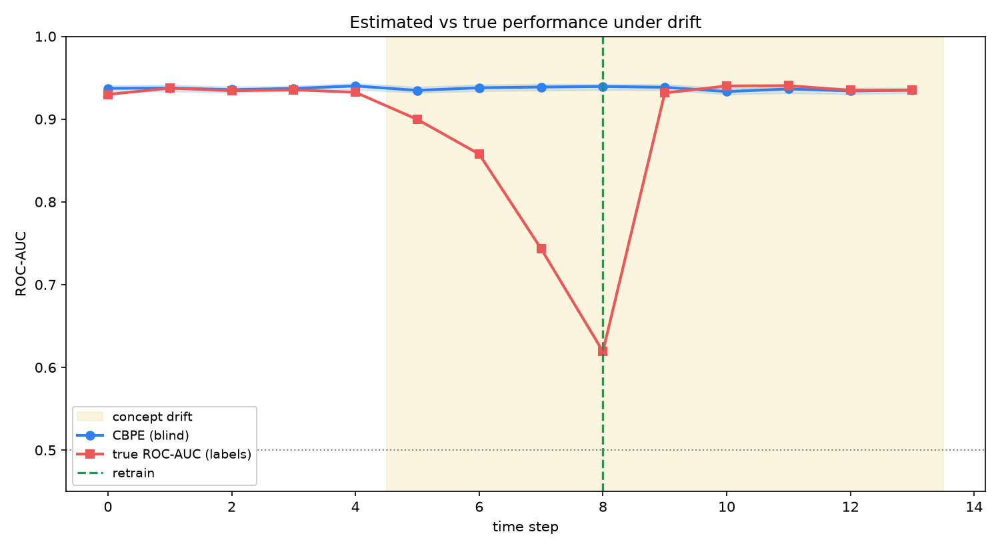

# AI Analyst Exercise — Customer Churn Prediction

> **Time estimate:** 2–3 hours  
> **Submission:** Share a GitHub repo with your code, outputs, and a brief write-up.

## Implementation Status

This repo contains the completed solution, not just the starter script. The
implementation keeps the pipeline leak-free, does **not** apply target-imbalance
handling (the label is balanced at 48.4% churn), cleans dirty rows inside the
sklearn pipeline, and frames the result honestly around the measured weak signal
(roughly 0.62 ROC-AUC).

Run the core workflow:

```bash
uv sync --all-groups
uv run python churn_prediction.py
uv run pytest -q
```

Batch scoring, monitoring, and the optional FastAPI demo:

```bash
uv run python -m churn.scoring --in data/customer_data.csv --out scored.csv
uv run python -m churn.monitoring --reference data/customer_data.csv --current data/customer_data.csv
uv sync --extra serve --all-groups
uv run uvicorn api.serve:app --reload
```

The Docker image is **self-contained** — it trains and registers a model at build
time, so a bare `docker run` serves `/score` with no mounted volume:

```bash
docker build -t churn-scoring .
docker run --rm -p 8000:8000 churn-scoring
# then: curl localhost:8000/health   →  {"status":"ok","model_loaded":true,...}
```

The main run writes PNG figures to `reports/figures/` and a registered model to
`models/<run_id>/`. `WRITEUP.md` is the reviewer-facing deliverable — decisions
(incl. the D1-D6 scope), findings, and interpretation.

---

## Production Platform (`enhancement` branch)

The base exercise establishes the honest finding: on the real 1,600-row data the churn signal is
**weak (~0.62 ROC-AUC)**. The `enhancement` branch builds a production MLOps platform *around* that
finding — and, because the real data cannot support strong event-feature claims, it does so on a
**pre-registered synthetic instrument**: a frozen simulator injects a latent-health signal and a
leak-free pipeline must recover it, clearing floors fixed *before* the confirmatory seed is revealed.
Everything below is a **synthetic-domain systems demonstration** — we never claim to *prove*
real-world performance or leak-freeness.

**Architecture.** Batch is the production decision (event log → DuckDB point-in-time features → score
→ tiers). One scoped online path (FastAPI `/score/online` reads Redis online features) exists to
demonstrate **train/serve consistency**: online features == offline PIT features, so the served score
equals the batch score for the same `(customer, t0)`.

**Five senior centerpieces** (see `ENHANCEMENT_PLAN.md` §7):
1. A validated instrument with a real **leakage-sentinel suite** + an enforceable frozen spec.
2. **Point-in-time correctness** — ASOF join + `max(feature_ts) ≤ t0 < min(label_ts)` + group-aware CV.
3. **Train/serve parity under adversarial streams** — late/dup/reordered/boundary events yield
   identical online (Redis) and offline (DuckDB) features, proven live through Redpanda + Quix.
4. **Delayed-label estimation with stated limits** — CBPE, demonstrably *blind to concept drift*.
5. **Promotion with statistical teeth** — paired ΔROC-AUC *and* ΔPR-AUC lower bounds past an MDE +
   calibration/segment guardrails; incumbent wins ties; a better-by-noise challenger is not promoted.



*The centerpiece backtest, with an honest label horizon: labels for step t only arrive at t+3
(stylized — the real 90-day churn label at weekly steps would be h≈13). Over the identical
drifting world, a **label-free trigger** (covariate drift detector) starts recovery as soon as
usable labeled data exists, while the **lagged-label trigger** must wait for the alarm to arrive
with the labels — the gap between the two deployed-AUC lines is the horizon bought back. The
companion chart (`backtest_blindspot.png`) shows the other side of the trade: under **pure
concept drift** the marginals never move, label-free monitors (detector + CBPE) are structurally
blind, and only the late labels catch it.* Regenerate with `uv run python -m churn.backtest.plots`.

**Run it.**

```bash
# Fast tier (host, no infra): unit + in-process parity + lifecycle logic
uv run pytest -q

# Real-infra tier (Docker): parity/serving/lifecycle vs LIVE Redpanda + Redis + MLflow
docker compose --profile test run --rm test-runner        # pytest -m integration

# The platform stack (opt-in profiles)
docker compose --profile streaming up -d      # Redpanda + producer + Quix consumer + Redis
docker compose --profile serve up -d          # FastAPI /score (+ /metrics)
docker compose --profile tracking up -d       # MLflow tracking + registry (champion/challenger)
docker compose --profile observability up -d  # Prometheus + Grafana (ops dashboards + SLO alerts)
docker compose --profile dashboard up -d      # Streamlit ML mission-control  (:8501)
```

**Where to read more:** `ENHANCEMENT_PLAN.md` (design + architecture), `IMPLEMENTATION_CHECKLIST.md`
(phase-ordered *what*), `PHASE0_LOCK_DECISIONS.md` (decision record D1–D8), `docs/adr/` (governance +
platform ADRs), `docs/RUNBOOK.md` (what to do when an alert fires). The pipeline stays leak-free by
argument from the **sentinel suite**, never claimed as proven on real data.

---

## Background

An e-commerce company is experiencing higher-than-expected customer attrition. The growth team wants to proactively identify customers who are likely to churn so that retention campaigns can be targeted effectively.

You have been given a dataset of **1,600 customer records**, each labelled with whether the customer churned within the following 90 days. Your task is to explore the data, build a churn prediction model, and surface insights that could guide retention strategy.

---

## Repository Structure

```
├── data/
│   └── customer_data.csv ← Dataset (do not modify)
├── src/churn/           ← Leak-free training, cleaning, scoring, registry, monitoring
├── api/
│   └── serve.py         ← FastAPI /score demo using the registered pipeline
├── tests/               ← Contract, leakage, metrics, scoring, monitoring tests
├── reports/figures/     ← Generated PNG deliverables
├── models/              ← Generated local model registry entries
├── churn_prediction.py  ← End-to-end entry point
├── WRITEUP.md           ← Decisions, findings, and interpretation
├── Dockerfile
├── .github/workflows/ci.yml
└── README.md            ← This file
```

---

## Dataset Description

**File:** `data/customer_data.csv`

| Column | Type | Description |
|---|---|---|
| `customer_id` | string | Unique customer identifier |
| `region` | string | Customer's geographic region |
| `device_type` | string | Primary device used (Mobile, Desktop, Tablet) |
| `subscription_plan` | string | Current plan (Free, Basic, Premium, Enterprise) |
| `account_age_days` | int | Days since account creation |
| `monthly_spend` | float | Average monthly spend over last 6 months (USD) |
| `num_orders_last_90d` | int | Number of orders placed in last 90 days |
| `avg_order_value` | float | Average value per order (USD) |
| `support_tickets_raised` | int | Support tickets opened in last 6 months |
| `days_since_last_login` | int | Days since the customer last logged in |
| `pages_per_session` | float | Average pages visited per session |
| `churned` | int | Target — 1 if customer churned, 0 otherwise |

> The dataset has class imbalance across subscription plans, missing values in some behavioural columns, a small proportion of outlier spend values, and a few records with logically impossible field values.

---

## Tasks

### Part 1 — Exploratory Data Analysis
1. Summarise the dataset: shape, types, missing values, and descriptive statistics.
2. Analyse the overall churn rate and churn rate broken down by `subscription_plan` and `region`.
3. Compare behavioural features (e.g. `days_since_last_login`, `monthly_spend`, `support_tickets_raised`) between churned and retained customers using appropriate plots.
4. Comment on any class imbalance you observe and how you plan to address it.

### Part 2 — Data Cleaning & Preprocessing
1. Identify and correct impossible values across all columns (think about valid real-world ranges).
2. Detect and handle outliers — document your method and rationale.
3. Impute missing values with a justified strategy for each column.
4. Encode categorical variables and scale features appropriately.
5. Engineer at least one new feature that you think could be predictive.

### Part 3 — Review & Improve the Starter Code
Open `churn_prediction.py` and the `src/churn/` package. They supersede the
starter pipeline with a leak-free implementation; the full defect catalog and
fix rationale are documented in `WRITEUP.md`.

Read through the code carefully. Some sections may produce misleading outputs, use incorrect metric implementations, or have subtle logical issues. Identify what needs fixing, apply your corrections with brief explanations, and extend the code to complete all parts of the exercise.

### Part 4 — Model Building & Evaluation
1. Train at least **two classification models**.
2. Report **Precision, Recall, F1-score, and ROC-AUC** for each model on the test set.
3. Plot the **ROC curve** for both models on the same axes.
4. Plot and interpret the **confusion matrix** for your best model.
5. Discuss which metric matters most in a business churn context and why.

### Part 5 — Business Interpretation *(encouraged)*
- Which customer profile is most at risk of churning?
- What retention action would you recommend for the highest-risk segment?
- How would you measure the real-world impact of deploying this model?

---

## Environment Setup

```bash
uv sync --all-groups
```

For the FastAPI demo, install the serving extra:

```bash
uv sync --extra serve --all-groups
```
---

## Submission Checklist

- [x] `churn_prediction.py` — complete and runnable end-to-end
- [x] All plots saved as `.png` under `reports/figures/`
- [x] `WRITEUP.md` covering decisions and findings
- [x] README Parts 1-5 implemented in `src/churn/`, `tests/`, and `churn_prediction.py`
- [x] Batch scoring CLI emits `customer_id`, `churn_probability`, `risk_tier`, and reason codes
- [x] Local registry, monitoring report, FastAPI demo, Dockerfile, and CI workflow included
